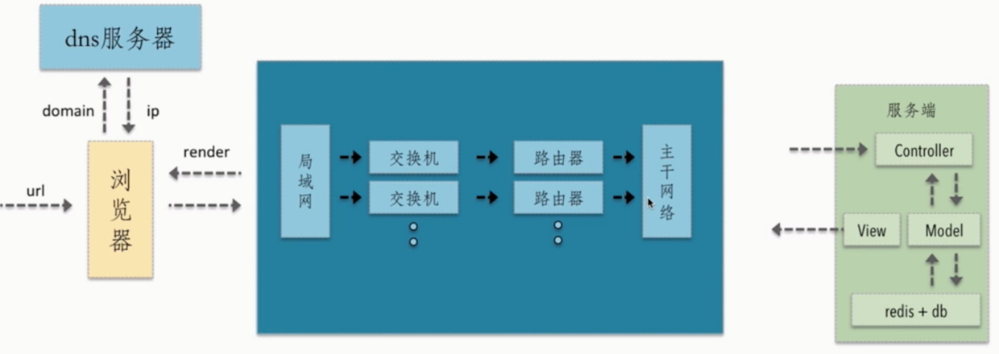
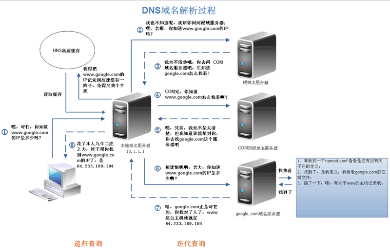
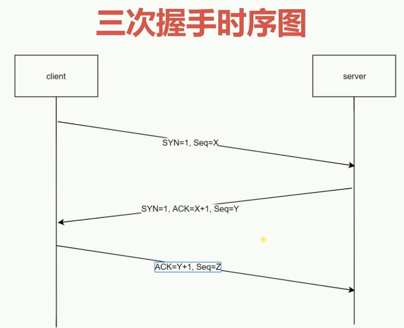
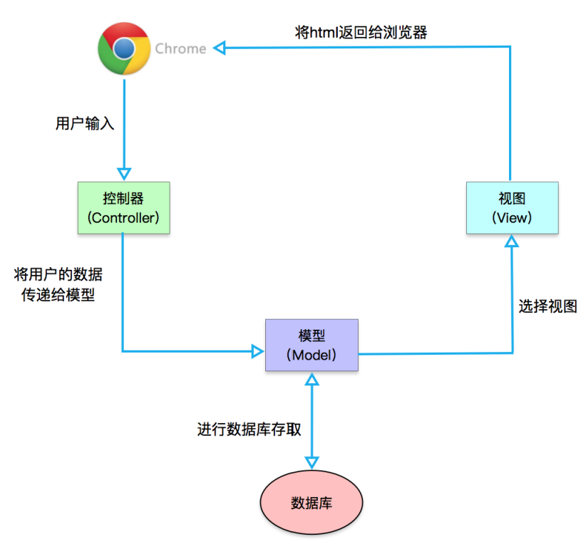
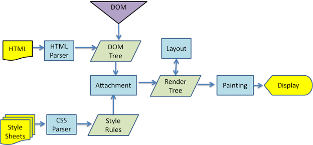

我们知道执行JS有一个JS引擎，那么执行渲染也有一个渲染引擎。同样渲染引擎在不同的浏览器中也不是都相同的。
- Firefox - Gecko
- Chrome和Safari - Webkit

## 浏览器输入URL到显示页面发生了什么


总体来说分为一下几个过程：
- DNS解析： 将域名解析成IP地址
- TCP连接： TCP三次握手
- 发送HTTP请求
- 服务器处理请求并返回HTTP报文
- 浏览器解析渲染页面
- 断开连接： TCP四次挥手

### 在浏览器中输入url，什么是url
URL(Uniform Rescource Locator),统一资源定位符，用于定位互联网上资源，俗称网址。
```
scheme: // host.domain:port / path / filename ? abc = 123 # 456789

scheme       - 定义因特网服务的类型。常见的协议有 http、https、ftp、file，其中最常见的类型是 http，而 https 则是进行加密的网络传输。
host         - 定义域主机（http 的默认主机是 www）
domain       - 定义因特网域名，比如 baidu.com
port         - 定义主机上的端口号（http 的默认端口号是 80）
path         - 定义服务器上的路径（如果省略，则文档必须位于网站的根目录中）。
filename     - 定义文档/资源的名称
query        - 即查询参数
fragment     - 即 # 后的hash值，一般用来定位到某个位置
```

### 1.1 DNS域名解析
在浏览器输入网址后，首先要经过域名解析，因为浏览器并不能直接通过域名找到对应的服务器，而是要通过IP地址。

#### IP地址
IP地址是指互联网协议地址，是IP address的缩写。IP地址是IP协议提供的一种统一的地址格式，它为互联网上的每一个网络和每一台主机分配一个逻辑地址，以此来屏蔽物理地址的差异。

#### 什么是域名解析
DNS协议提供通过域名查找IP地址，或逆向从IP地址反查域名的服务。DNS是一个网络服务器，我们的域名解析简单来说就是在DNS上记录一条信息记录。

#### 浏览器如何通过域名去查询URL对应的IP呢？
DNS域名解析分为递归查询和迭代查询两种方式，现一般为迭代查询。<br>


在 TCP 握手之前就已经进行了 DNS 查询，这个查询是操作系统自己做的。当你在浏览器中想访问 www.google.com 时，会进行一下操作：
- 1.操作系统会首先在本地缓存中查询 IP
- 2.没有的话会去系统配置的 DNS 服务器中查询
- 3.如果这时候还没得话，会直接去 DNS 根服务器查询，这一步查询会找出负责 com 这个一级域名的服务器
- 4.然后去该服务器查询 google 这个二级域名
- 5.接下来三级域名的查询其实是我们配置的，你可以给 www 这个域名配置一个 IP，然后还可以给别的三级域名配置一个 IP

以上介绍的是 DNS 迭代查询，还有种是递归查询，区别就是前者是由客户端去做请求，后者是由系统配置的 DNS 服务器做请求，得到结果后将数据返回给客户端。

#### 小结
浏览器通过向DNS服务器发送域名，DNS服务器查询到与域名相对应的IP地址，然后返回给浏览器，浏览器再将IP地址打在协议上，同时请求参数也会在协议上搭载，然后一并发送到对应的服务器。

`扩展：DNS优化`<br>
- DNS缓存： DNS存在着多级缓存，从离浏览器的距离排序的话，有以下几种：浏览器缓存，系统缓存，路由器缓存，IPS服务器缓存，根域名服务器缓存，顶级域名服务器缓存，主域名服务器缓存。
- DNS负载均衡（DNS重定向）：DNS负载均衡技术的实现原理是在DNS服务器中为同一个主机名配置多个IP地址，在应答DNS查询时，DNS服务器对每个查询将以DNS文件中主机记录的IP地址按顺序返回不同的解析结果，将客户端的访问引导到不同的机器上去，使得不同的客户端访问不同的服务器，从而达到负载均衡的目的

### 1.2 TCP三次握手
在客户端发送数据之前会发起TCP三次握手用以同步客户端和服务端的序列号和确认号，并交换TCP窗口大小信息。<br>


#### TCP三次握手的过程如下
- 客户端发送一个带SYN=1,Seq=X的数据包到服务器端口
- 服务器发挥一个带SYN=1,ACK=X+1,Seq=Y的响应包以示传达确认信息
- 客户端再回传一个带ACK=Y+1,Seq=Z的数据包，代表“握手结束”

`为什么三次握手谢稀仁著《计算机网络》中讲“三次握手”的目的是“为了防止已失效的连接请求报文段突然又传送到服务器因而产生错误”`

### 1.3 发送HTTP请求
TCP三次握手结束后，开始发送HTTP请求报文。请求报文由请求行、请求头、请求体三个部分组成。

#### 请求行
请求行包含请求方法、URL、协议版本
- 请求方法包含八种：GET POST PUT DELETE PATCH HEAD OPTIONS TRACE
- URL及请求地址，由<协议>://<主机>:<端口>/<路径>?<参数> 组成
- 协议版本即http版本号

#### 请求头
请求头包含请求的附加信息，由关键字/值对组成，每行一对，关键字和值用用英文冒号“:”分隔<br>
请求头部通知服务器有关于客户端请求的信息。它包含许多有关的客户端环境和请求正文的有用信息。其中比如：Host,表示主机名，虚拟主机；Connection,HTTP/1.1增加的，使用keepalive，即持久连接，一个连接可以发送多个请求，User-Agent,请求发送者，兼容性以及定制化需求。

#### 请求体
请求体，可以承载多个请求参数的数据，包含回车符、换行符和请求数据，并不是所有请求都具有请求数据。

### 1.4 服务器处理请求并返回HTTP报文
每台服务器上都会安装处理请求的应用---Web server。常见的web server产品有apache、nginx、IIS、Lighttpd等。但大部分都还是按照MVC设计模式进行搭建的。<br>


### 1.5 浏览器解析渲染页面


#### 浏览器的主要功能
浏览器的主要功能就是向服务器发出请求，在浏览器窗口中展示您选择的网络资源，这里所说的资源一般是指HTML文档，也可以是PDF、图片或其他的类型。资源的位置由用户使用URI（统一资源标示符）指定。<br>
浏览器解释并显示HTML文件得方式是在HTML和CSS规范中指定的。这些规定由网络标准化组织W3C（万维网联盟）进行维护，多年以来，各浏览器都没有完全遵从这些规范，同时还在开发自己特有的扩展程序，这给网络开发人员带来了严重的兼容性问题。如今，大多数的浏览器都是或多或少地遵从规范。

#### 浏览器的主要构成
- 用户界面(user Interface) - 包括地址栏、后退/前进按钮、书签目录等，也就是你所看到的除了用来显示你所请求页面的主窗口之外的其他部分。
- 浏览器引擎(Browser Engine) - 用来查询及操作渲染引擎的接口。
- 渲染引擎(Rendering Engine) - 用来显示请求的内容，例如，如果请求内容为html，它负责解析html及css，并将解析后的结果显示出来。
- 网络(Networking) - 用来完成网络调用，例如http请求，它具有平台无关的接口，可以在不同平台上工作。
- UI后端(ui Backend) - 用来绘制类似组合选择框及对话框等基本组件，具有不特定于某个平台的通用接口，底层使用操作系统的用户接口。
- JS解释器(JS interpreter) - 用来解释执行JS代码。
- 数据存储(DB perSISTENCE) - 属于持久层，浏览器需要在硬盘中保存类似cookie的各种数据，HTML5定义了web database技术，这是一种轻量级完整的客户端存储技术。

#### 浏览器的渲染过程


**1.HTML解析，构建DOM**<br>
浏览器解析HTML，构建DOM树。解析HTML到构建DOM过程可以简述如下：
```
Bytes -> characters -> tokens -> nodes ->DOM
```
其中比较关键的步骤：
- conversion转换：浏览器将获得的HTML内容（字节数据Bytes)基于它的转码转换为单个字符

- Tokenizing分词：浏览器按照HTML规范标准将这些字符转换为不同的标记（token）。每个token都有自己独特的含义以及规则集（这一过程在词法分析中叫标记化）

- Lexing词法分析：分词的结果就是得到一堆的token，此时把他们转换为节点对象（node），这些对象分别定义他们的属性和规则

- DOM构建：因为HTML标记定义的就是不同标签之间的关系，这个关系就像是一个树形结构一样

事实上，构建DOM的过程中，不是等所有Token都转换完成后再去生成节点对象，二十一边生成Token一边消耗Token来生成节点对象。换句话说，每个Token被生成后，会立刻消耗这个Token创建出节点对象。注意：带有结束标示符的Token不会创建节点对象。

还有两点需要注意的地方。第一，DOM树解析的过程是一个深度优先遍历，即先构建当前节点的所有子节点，再构建下一个兄弟节点。第二，若遇到JavaScript标签，则DOM树的构建会暂停，直至脚本执行完毕。

**2.解析CSS，生成CSS规则树**<br>
同理，CSS规则树的生成也是类似
```
Bytes -> characters -> token -> nodes -> CSSOM
```
在这一过程中，浏览器会确定下每一个节点的样式到底是什么，并且这一过程其实是很消耗资源的。因为样式你可以自行设置给某个节点，也可以通过继承获得。在这一过程中，浏览器得递归CSSOM树，然后确定具体的元素到底是什么样式。

同时，**解析css规则树时js执行将暂停**，直至CSS规则树就绪。

注意：css匹配HTML元素是一个相当复杂和有性能问题的事情。所以DOM树要小，css尽量用id和class，千万不要过度层叠下去。

**3.合并DOM树和css规则，生成render树**<br>
当我们生成DOM树和CSSOM树以后，就需要将这两棵树组合为渲染树。一般来说，渲染树和DOM树是相对应的，但不是严格意义上的一一对应，因为有一些不可见的DOM元素不会插入到渲染树中，如head这种不可见的标签或者display:none等。<br>

**4.布局render树（Layout/reflow),负责各元素尺寸、位置的计算**<br>
布局（根据渲染树来进行布局，也叫回流）：通过渲染树中渲染对象的信息，计算出每一个渲染对象的位置和尺寸。layout：也称为reflow，即回流。一般意味着元素的内容、结构、位置或尺寸发生了变化，需要重新计算样式和渲染树。<br>

**5.绘制render树（paint)，绘制页面像素信息**<br>
绘制阶段：系统会遍历呈现树，并调用呈现器的“paint”方法，将呈现器的内容显示在屏幕上。repaint：即重绘。意味着元素发生的改变只是影响了元素的一些外观之类的时候（例如：背景色、边框颜色、文字颜色等），此时只需要应用新样式绘制这个元素就可以了。

#### 1.6 断开连接
当数据传送完毕，需要断开TCP连接，此时发起TCP四次挥手
- 发起方向被动方发送报文，FIN=1、ACK=Z、Seq=X，表示已经没有数据传输了。并进入FIN_WAIT_1状态。（第一次挥手：由浏览器发起的，发送给服务器，我请求报文发送完了，你准备关闭吧）
- 被动方发送报文，ACK=X+1，Seq=Z，表示同意关闭请求。此时主机发起方进入FIN_WAIT_2状态。（第二次挥手：由服务器发起的，告诉浏览器，我请求报文接收完了，我准备关闭了，你也准备吧）
- 被动方向发起方发送报文段，FIN=1、ACK=X、Seq=Y，请求关闭连接。并进入LAST_ACK状态。（第三次挥手：由服务器发起，告诉浏览器，我响应报文发送完了，你准备关闭吧）
- 发起方向被动方发送报文，ACK=Y、Seq=X。然后进入等待TIME_WAIT状态。被动方收到发起方的报文段以后关闭连接。发起方等待一定时间未收到回复，则正常关闭。（第四次挥手：由浏览器发起，告诉服务器，我响应报文节后完了，我准备关闭了，你也准备吧）
>  [参考文章]:  https://juejin.cn/post/6844903816114995213


### 重绘和回流
重绘和回流会在我们设置节点样式时频繁出现，同时也会很大程度上影响性能。

- 重绘是当节点需要更改外观而不会影响布局的，比如改变 color 就叫称为重绘。

- 回流是布局或者几何属性需要改变就称为回流。

**回流必定会发生重绘，重绘不一定会引发回流**。回流所需的成本比重绘高的多，改变父节点里的子节点很可能会导致父节点的一系列回流。

以下几个动作可能会导致性能问题：
- 改变window大小
- 改变字体
- 添加或删除样式
- 文字改变
- 定位或者浮动
- 盒模型

并且很多人不知道的是，重绘和回流其实也和Eventloop有关：

- 1.当Eventloop执行完Microtasks后，会判断document是否需要更新，因为浏览器是60Hz的刷新率，每16.6ms才会更新一次。

- 2.然后判断是否有resize或scroll事件，有的话会触发事件，所以resize和scroll事件也是至少16.6ms才会触发一次，并且自带节流功能

- 3.判断是否出发了media query

- 4.更新动画并发送事件

- 5.判断是否有全屏操作事件

- 6.执行requestAnimationFrame回调

- 7.执行IntersectionObserver回调，该方法用于判断元素是否可见，可以用于懒加载上，但是兼容性不好

- 8.更新界面

- 9，以上就是一帧中可能会做的事情。如果在一帧中有空闲事件，就回去执行requestIdleCallback回调

#### 如何减少重绘和回流
- 使用transform替代top

- 使用visiblility替代display:none

- 不要把节点的属性值放在一个循环里当成循环里的变量
```
for(let i = 0; i < 1000; i++) {
    // 获取 offsetTop 会导致回流，因为需要去获取正确的值
    console.log(document.querySelector('.test').style.offsetTop)
}
```
- 不要使用 table 布局，可能很小的一个小改动会造成整个 table 的重新布局

- 动画实现的速度的选择，动画速度越快，回流次数越多，也可以选择使用 requestAnimationFrame

- CSS 选择符从右往左匹配查找，避免节点层级过多

- 将频繁重绘或者回流的节点设置为图层，图层能够阻止该节点的渲染行为影响别的节点。比如对于 video 标签来说，浏览器会自动将该节点变为图层。
  设置节点为图层的方式有很多，我们可以通过以下几个常用属性可以生成新图层: will-change、video标签、iframe标签


### 思考：为什么操作DOM慢
因为DOM是属于渲染引擎中的东西，而JS又是JS引擎中的东西。当我们通过JS操作DOM的时候，其实这个操作涉及到了两个线程之间的通信，那么势必会带来一些性能上的损耗。操作DOM次数一多，也就等同于一直在进行线程之间的通信，并且操作DOM可能还会带来重绘回流的情况，所以也就导致了性能上的问题。

> 面试题：插入几万个DOM，如何实现页面不卡顿
对于这道题目来说，首先我们肯定不能一次性把几万个 DOM 全部插入，这样肯定会造成卡顿，所以解决问题的重点应该是如何分批次部分渲染 DOM。大部分人应该可以想到通过 requestAnimationFrame 的方式去循环的插入 DOM，其实还有种方式去解决这个问题：**虚拟滚动**（virtualized scroller）。

这种技术的原理就是只渲染可视区域内的内容，非可见区域的那就完全不渲染了，当用户在滚动的时候就实时去替换渲染的内容。

### 思考：什么情况阻塞渲染
首先渲染的前提是生成渲染树，所以 HTML 和 CSS 肯定会阻塞渲染。如果你想渲染的越快，你越应该降低一开始需要渲染的文件大小，并且扁平层级，优化选择器。

然后当浏览器在**解析到 script 标签时，会暂停构建 DOM**，完成后才会从暂停的地方重新开始。也就是说，如果你想首屏渲染的越快，就越不应该在首屏就加载 JS 文件，这也是都建议将 script 标签放在 body 标签底部的原因。

当然在当下，并不是说 script 标签必须放在底部，因为你可以给 script 标签添加 defer 或者 async 属性。

当 script 标签加上 defer 属性以后，表示该 JS 文件会并行下载，但是会放到 HTML 解析完成后顺序执行，所以对于这种情况你可以把 script 标签放在任意位置。

对于没有任何依赖的 JS 文件可以加上 async 属性，表示 JS 文件会并行下载，但下载完会立即解析，然后阻塞渲染。
